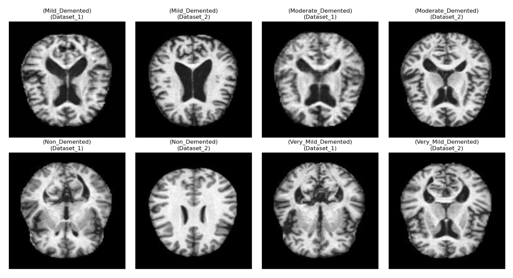
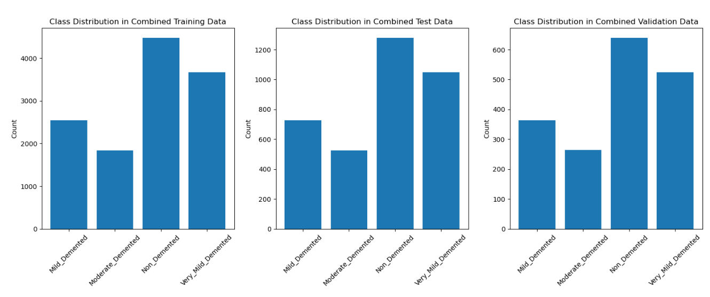
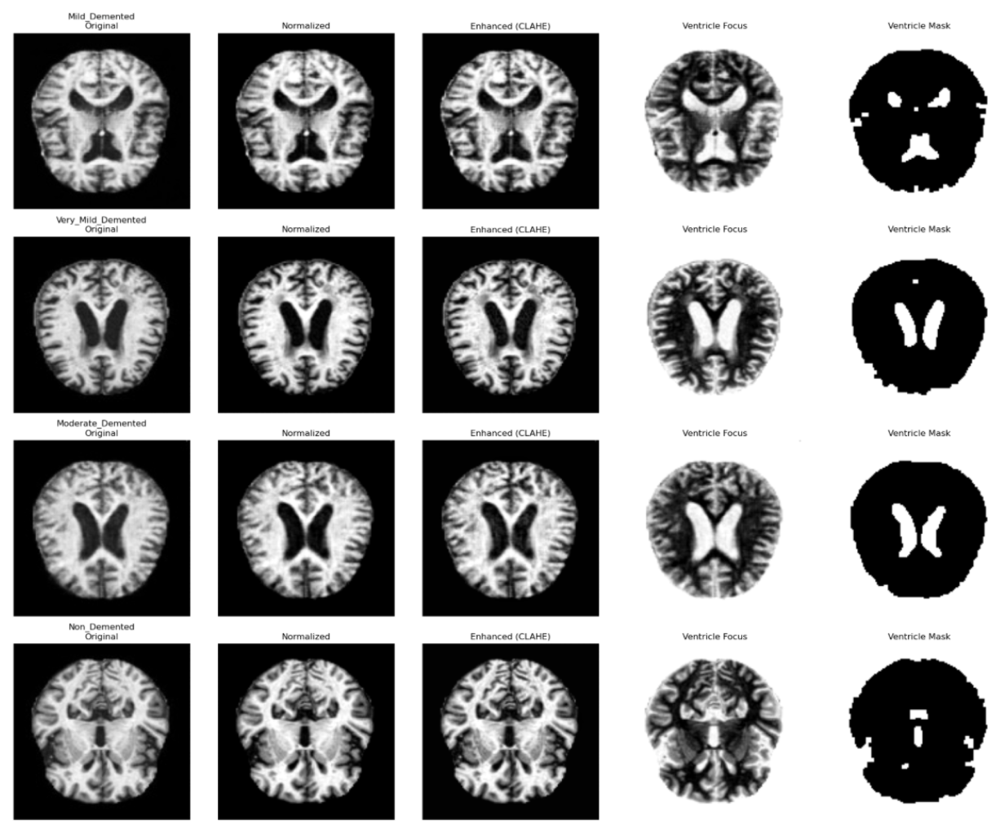
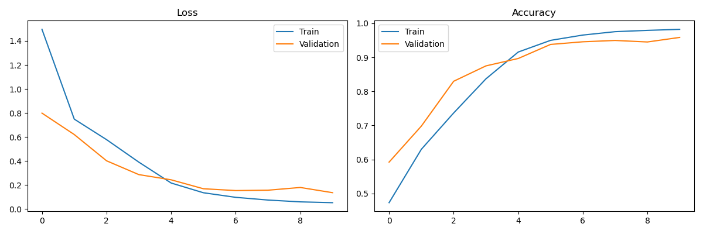
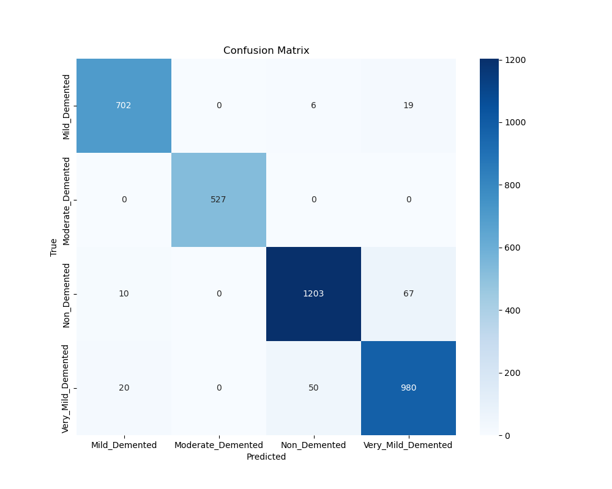
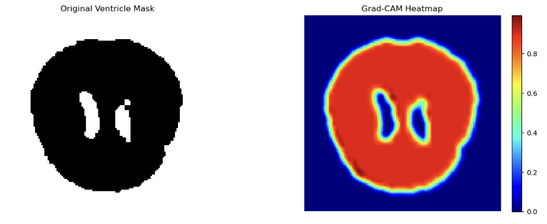

# Alzheimer's Disease MRI Classification

youtube link for the Midterm report: https://youtu.be/vV8o-egBJ6o
<br>
youtube link for Final Report: 

## Summary 

This project is to implement a deep learning-based model for automated classification of Alzheimer's disease stages using brain MRI scans. The goal of this model is to categorize scans into four stages: Non-Demented, Very Mild Demented, Mild Demented, and Moderate Demented; ultimately aiming to aide with more precise and efficent diagnose of Alzheimers Disease.

## Data Collection

We began the pipeline by integrating two distinct MRI datasets: a [folder based dataset](https://www.kaggle.com/datasets/lukechugh/best-alzheimer-mri-dataset-99-accuracy/data) containing MRI images in standard image formats (JPEG, PNG) organized by impairment level folders, and a [parquet based dataset](https://www.kaggle.com/datasets/borhanitrash/alzheimer-mri-disease-classification-dataset/data) containing binary image data stored in Apache Parquet format. Both datasets contain brain MRI scans used for dementia classification with four severity levels: Non-Demented, Very Mild Demented, Mild Demented, and Moderate Demented. 



## Data Preprocessing

For data standardization, we applied several procedures to the raw images. These included dimension normalization where all images were resized to 128×128 pixels, conversion to grayscale (single-channel) to ensure consistent formatting, and intensity scaling where pixel values were normalized to the range [0-1] by dividing by 255 to ensure compatibility with neural networks.

To balance the dataset, we employed stratified data splitting using sklearn's train_test_split function to maintain class distribution, resulting in a three-way partition: **70% for training, 10% for validation, and 20% for testing**. The directories were organized with structured folders following a train/val/test organization, each containing class subfolders. This approach ensured that the proportion of diagnostic classes was preserved in each split, supporting proper model training and evaluation.



## Feature Extraction

To ensure consistency and to reduce the impact of noise commonly found in MRI scans, pixel values were rescaled to [0-1]. To enhance structural details, we used Contrast Limited Adaptive Histogram Equalization (CLAHE) with an 8×8 tile grid and a clip limit of 2.0. This helped improve local contrast making brain structures more distinguishable. The parameters were chosen to balance detail enhancement without over-amplifying noise.

Since ventricle enlargement is a key biomarker for dementia, we focused on segmenting the lateral ventricles. First, we inverted the images so that dark ventricles appeared bright. Then, we created ventricle masks using Otsu thresholding, an adaptive method that automatically determines the optimal threshold value, followed by applying a 50% factor to this threshold. We then applied morphological operations (opening and closing) to refine the segmentation. These steps helped isolate ventricles while reducing noise and preserving structural integrity.



## Modeling Approach

This project uses a custom CNN to classify dementia from 128×128 grayscale MRI scans by analyzing ventricle features. The model has two convolutional blocks that extract important details—each block applies convolution, ReLU activation, batch normalization, and max pooling to reduce image size while keeping key features. The first block uses 64 filters, and the second increases to 128 to capture more complex patterns. After feature extraction, the model flattens the data and processes it through two dense layers (512 and 128 units) with dropout (30% and 20%) to prevent overfitting. Despite its compact design, the model performs well, achieving 95.2% accuracy on the test set while remaining efficient.

For training, we used the AdamW optimizer with weight decay (1e-4) to improve generalization. The model was trained for 10 epochs with a batch size of 32 images, using CrossEntropyLoss for multi-class classification. A learning rate scheduler (ReduceLROnPlateau) adjusted the learning rate when performance plateaued, and early stopping with model checkpointing ensured the best model was saved based on validation accuracy.

## Training Results



Our training phase consisted of 10 epochs, with significant improvements in accuracy throughout the process. Starting at 47.29% training accuracy in epoch 1, progressed to 98.25% by epoch 10. The model showed high validation performance, beginning at 59.21% and reaching 95.87% by the final epoch.

Intrestingly, our per-class validation accuracies show high accuracy for the Moderate Demented class, which is close to 100% for each epoch. Yet, this class has the least number of sample, so we may need to oversample the Moderate Demented class to ensure the reliability of the model's accuracy. In addition, the accuracy of our model seeems extremely high and might have to deal with the simplicity of our current dataset. As such, we are working on obtaining more images from supplementary datasets from ADNI (Alzheimer's Disease Neuroimaging Initiative) databas and OASIS (Open Access Series of Imaging Studies) to increase the overall range our model can cover in MRI brain scans.

## Testing results 

The model achieved a 93.05% overall accuracy, with detailed metrics showing excellent class-specific performance: perfect classification for Moderate Demented cases (100% precision/recall/F1-score), strong results for Mild Demented (95.55% precision, 94.50% recall, 95.02% F1-score), and slightly lower but still robust performance for Non-Demented (90.59% precision, 94.06% recall, 92.30% F1-score) and Very Mild Demented (90.88% precision, 87.33% recall, 89.07% F1-score). The confusion matrix revealed the most common misclassifications occurred between Non-Demented and Very Mild Demented (66 cases) and Mild Demented and Very Mild Demented (26 cases).

## GRADCAM visualization


This heat map visualization shows which regions of the brain MRI the neural network is focusing on when making its classification decision. The red/orange areas indicate regions with the highest activation or influence on the model's prediction, while blue areas represent regions with minimal influence.

## Usage 

Here, we developed a simple brain MRI classifier that tests a deep learning model on new brain images. Our tool processes MRI scans to highlight ventricle features and predicts whether a scan indicates Non-Demented, Very Mild, Mild, or Moderate dementia.

To evaluate the model's performance on a new dataset (consisting of unseen brain scan images, confirmed to be distinct from our training set using perceptual hashing), first download the ZIP file containing brain MRI images from this [Kaggle dataset zip file 1](https://www.kaggle.com/datasets/borhanitrash/alzheimer-mri-disease-classification-dataset/data?select=Alzheimer+MRI+Disease+Classification+Dataset) and [Kaggle dataset zip file 2](https://www.kaggle.com/datasets/lukechugh/best-alzheimer-mri-dataset-99-accuracy/data)


After downloading the files, navigate to the directory containing the **mriclassifier.mk** script and run the following command in your conda environment:

```
make -f mriclassifier.mk
```
Running this command will install the required dependencies, retrieve the model, normalize and extract features from the new dataset, and make a prediction for a sample image.

---
Alternatively, if you prefer to run the scripts manually without using the Makefile, follow these steps after downloading the zip files from the Kaggle website:

First, run the following command to retrieve the model, normalize, and extract features from the new dataset:

```
pip install -r requirements.txt
python mri_dementia_classification.py --zip_file1 "Alzheimer MRI Disease Classification Dataset-2.zip" --zip_file2 "Combined Dataset.zip" --output_dir "Combined_MRI_Dataset" --epochs 10
```

Next, execute the following command to test if the model correctly predicts the class of an image:

```
simple_mri_classifier.py --image 14.png --model best_model.pt
```

To test other images from the dataset, simply replace 14.png with the filename of any image you would like to classify!
Here is a new Dataset that you can try [Kaggle dataset](https://www.kaggle.com/datasets/uraninjo/augmented-alzheimer-mri-dataset).

